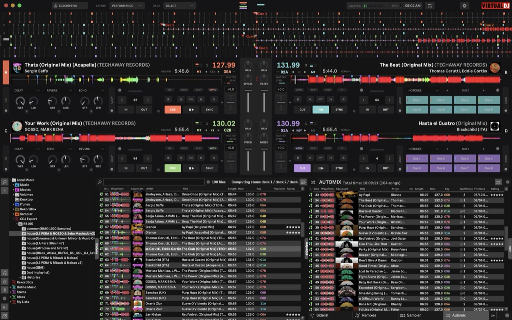

# VDJ Skin Default Flat — Ableton Edition

> An Ableton Live-inspired skin for VirtualDJ: flat design with no borders, coral-orange/teal accent palette, and the original Ableton font.

  

## 📸 Preview



## ✨ Features

- **4 color schemes** (switch via the Color Scheme menu):
  - **Default** — Ableton standard dark (mid-gray `#3d3d3d` base)
  - **Contrast** — high-contrast dark (darker base, brighter text)
  - **Dark** — near-black (`#1a1a1a` base)
  - **Daylight** — Ableton light theme
- **Ableton accent palette**:
  - Deck A/C: coral orange `#ff7657` (Ableton signature color)
  - Deck B/D: light teal `#7ed1d1`
  - Deck 3: light green `#9cd37e` / Deck 4: light purple `#b48be1`
- **Flat, borderless** — all button/panel/waveform/browser borders removed
- **Original Ableton font**: `AbletonSans Small` (extracted from Ableton Live 12, see `fonts/`)
- **5 layouts**: Essentials / Pro / Performance / Starter / Vertical

## 📦 Installation

1. **Install the fonts** (required): double-click the 4 `.ttf` files in the `fonts/` folder
   - `AbletonSansSmall-Regular.ttf` — main UI font
   - `AbletonSansSmall-Bold.ttf` — numbers/emphasis
   - `AbletonSansSmall-RegularItalic.ttf` — italic
   - `AbletonSans-Light.ttf` — large headings

2. **Install the skin**: copy the whole folder into the VirtualDJ Skins directory:
   - Windows: `C:\Users\<username>\Documents\VirtualDJ\Skins\`
   - macOS: `~/Documents/VirtualDJ/Skins/`

3. In VirtualDJ, select **VDJ Skin Default Flat** from the **LAYOUT** menu

## 🎨 Switching Color Schemes

LAYOUT → Color Scheme → Default / Contrast / Dark / Daylight

## 📁 Structure

```
VDJ Skin Default Flat/
├── Essentials.xml        # Essentials layout
├── Pro.xml               # Pro layout
├── Performance.xml       # Performance layout (incl. 4-deck)
├── Starter.xml           # Starter layout
├── Vertical.xml          # Vertical layout
├── gfx-basic.png         # Basic graphics sprite
├── gfx-pro.png           # Pro graphics sprite
├── screenshot.jpg        # Preview screenshot
└── fonts/                # AbletonSans font files
```

## 🛠 Customization

### Colors

All colors are defined in the `<group name="colorscheme">` section of each XML:

```xml
<define color="background" value="#3d3d3d"/>                    <!-- main background -->
<define color="deckcolor" value="#ff7657" deck="left"/>          <!-- Deck A color -->
<define color="deckcolor" value="#7ed1d1" deck="right"/>         <!-- Deck B color -->
```

### Font

```xml
<font name="Ableton Sans Small"/>
```

## ⚠️ Disclaimer

This project is not affiliated with, sponsored by, or endorsed by Ableton or Atomix Productions / VirtualDJ. The AbletonSans font is © Ableton and is included for personal use only.

## 📜 License

Skin XML is derived from the VirtualDJ default skin (© Atomix Productions). Modifications are provided for learning and personal use.
